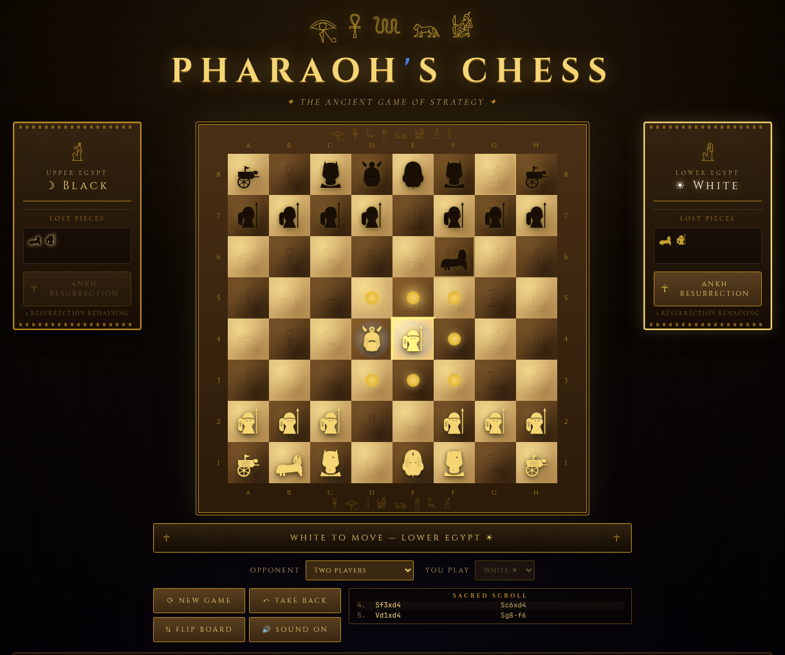
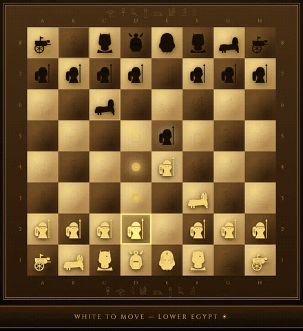

<div align="center">


[](https://highviewone.github.io/EgyptianChess/)
[](LICENSE)
[](https://github.com/HighviewOne/EgyptianChess/commits/main)
[](index.html)

*A browser-based chess variant set in ancient Egypt — same board, new rules, new pieces.*

</div>

---

## Overview

Egyptian Chess replaces standard chess pieces with their ancient Egyptian equivalents and introduces three new mechanics that fundamentally change how the game is played. No installation, no framework, no build step — open `index.html` and play.

<p align="center">
  
</p>

| Standard piece | Egyptian name | Special power |
|---|---|---|
| King | **Pharaoh** | — |
| Queen | **Vizier** | — |
| Rook | **Chariot** | — |
| Bishop | **Priest (Anubis)** | — |
| Knight | **Sphinx** | Extended movement ↓ |
| Pawn | **Soldier** | — |

---

## Egyptian Rules

<p align="center">
  
</p>

### Sphinx Movement
The Sphinx combines a standard knight's L-jump with short diagonal slides: it can move to any of the 8 knight squares **or** slide 1–2 squares diagonally (blocked by intervening pieces). It cannot jump over pieces during diagonal slides.

### ☥ Ankh Resurrection
Once per game, on your turn, you may spend your move to resurrect the most recently captured piece of your own that is not your Pharaoh, placing it on any empty square on your home two ranks (rows 7–8 for White, rows 1–2 for Black). The placement is illegal if it leaves your Pharaoh in check.

### Blessing of the Pyramid
The four central squares — **d4, d5, e4, e5** — form the sacred Pyramid Zone. A piece standing on one may, in addition to its normal moves, move or capture **one square in any direction**, like the Pharaoh. A blessed Priest can step sideways, a blessed Chariot diagonally, and a blessed Soldier even backward. Their golden glow intensifies when occupied, making them the focal point of the middle game.

### Other rule changes
- **No castling** — the Chariot stands alone
- **En passant** retained as-is
- **Promotion** choices: Vizier, Chariot, Priest, or Sphinx
- **Mate and stalemate** count an unused Ankh: if a resurrection could block or escape, the game goes on
- **Draws** by threefold repetition, the fifty-move rule (a resurrection resets it, like a capture or Soldier move), or insufficient material (lone Pharaohs or a single Priest, with no Ankh left)
- **Promoted pieces** that are captured are lost — and resurrected — as Soldiers

---

## Features

- **Custom SVG pieces** — hand-crafted Egyptian silhouettes, styled via CSS `currentColor`
- **Hi-fi visual design** — carved sandstone board, hieroglyph frieze, ambient wall texture, vignette
- **Particle effects** — 12-particle sand-dust burst on capture; cinematic 10-ray ankh burst on resurrection
- **WebAudio sounds** — procedural oscillator tones for select, move, capture, check, ankh, and victory; no audio files
- **Move log** — long algebraic notation with unique Egyptian symbols (Ph Pharaoh, V Vizier, C Chariot, Pr Priest, S Sphinx; Soldiers unmarked), plus `+` check, `#` mate, `=V` promotion, `☥` resurrection
- **Computer opponent** — Easy, Medium, or Hard; play either side. It understands the Ankh (and will resurrect to escape mate) and steers away from repetition draws when ahead. On the live site the search runs in a background thread so the page never stalls
- **Autosave** — the game in progress survives a refresh or closed tab (saved in your browser as its move list and replayed on load)
- **Take back, flip, mute** — unlimited undo (Ctrl+Z), board flip for Black's view, sound toggle that remembers your choice
- **Keyboard & screen reader friendly** — arrow keys move around the board, Enter selects; squares, captures, and status are announced
- **Responsive** — collapses to single column below 1060 px; smaller squares below 600 px
- **Zero dependencies** — vanilla HTML/CSS/JS, runs from the filesystem with no server

---

## Getting Started

```bash
git clone https://github.com/HighviewOne/EgyptianChess.git
cd EgyptianChess
open index.html        # macOS
xdg-open index.html   # Linux
# or just drag index.html into any modern browser
```

Or play instantly: **[highviewone.github.io/EgyptianChess](https://highviewone.github.io/EgyptianChess/)**

### Running the tests

The engine and game rules have a small test suite that uses Node's built-in runner (Node 18+, no install step):

```bash
node --test
```

---

## Project Structure

```
EgyptianChess/
├── index.html          # Shell, layout, dialogs
├── css/
│   └── style.css       # Design tokens, animations, responsive layout
├── js/
│   ├── engine.js       # Pure game logic (window.PharaohEngine)
│   ├── pieces-svg.js   # Egyptian SVG silhouettes (window.PIECE_SVGS)
│   ├── game.js         # GameState class — move execution, Ankh logic, draws, undo
│   ├── ai.js           # Computer opponent — alpha-beta search (window.PharaohAI)
│   ├── ai-worker.js    # Runs the search off the main thread when served over http(s)
│   └── ui.js           # Rendering, WebAudio, particle FX, event handling
├── tests/
│   └── rules.test.js   # node --test suite for engine + GameState
└── docs/
    ├── banner.svg      # README banner
    ├── screenshot.png  # README screenshot
    └── demo.gif        # README gameplay clip
```

---

## Browser Support

Requires a modern browser with ES6 classes, Web Animations API, and WebAudio API.

| Chrome | Firefox | Safari | Edge |
|--------|---------|--------|------|
| 90+ ✓ | 90+ ✓ | 15+ ✓ | 90+ ✓ |

---

## Contributing

Bug reports and feature ideas are welcome — see the [issue templates](.github/ISSUE_TEMPLATE/) to get started. For code changes, please check the [PR template](.github/pull_request_template.md) testing checklist before opening a pull request.

---

## License

[MIT](LICENSE) — free to use, modify, and distribute.
